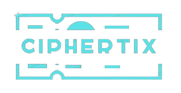

<!DOCTYPE html>
<html lang="en">
<head>
    
</head>
<body>
    

        

        <h1>Ciphertix: A Decentralized Ticket Booking App 🎟️</h1>
        
Welcome to <strong>Ciphertix</strong>, your go-to ticket booking application!

        <h2>Overview 🚀</h2>
        
Ciphertix is a blockchain-based ticket booking app that simplifies the ticket booking process while ensuring security, transparency, and reliability through blockchain technology. Users can easily browse, select, and book tickets for various events with confidence.

        <h2>Features ✨</h2>
        <ul>
            <li><strong>Blockchain Technology:</strong> Secure and transparent ticket transactions using Ethereum blockchain.</li>
            <li><strong>User-Friendly Interface:</strong> Intuitive UI/UX designed with React for seamless navigation and booking experience.</li>
            <li><strong>Flexible Backend:</strong> Powered by Node.js for smooth functionality and robust performance.</li>
            <li><strong>Integration with Gemini API:</strong> Access a wide range of events and booking options through Google's Gemini API.</li>
            <li><strong>Secure Transactions:</strong> Blockchain ensures secure, transparent, and immutable ticket transactions.</li>
            <li><strong>Efficient Ticket Management:</strong> Easily manage booked tickets and track event attendance.</li>
        </ul>
        <h2>Getting Started 🛠️</h2>
        <ol>
            <li>Clone the repository to your local machine.</li>
            <li>Install dependencies: <code>npm install</code>.</li>
            <li>Start the frontend server: <code>npm start</code>.</li>
            <li>Set up the backend server: Navigate to the server directory and run <code>npm start</code>.</li>
        </ol>
        <h2>Technologies Used 🛠️</h2>
        <ul>
            <li><strong>Frontend:</strong> React</li>
            <li><strong>Backend:</strong> Node.js</li>
            <li><strong>Blockchain:</strong> Ethereum</li>
            <li><strong>API:</strong> Google's Gemini API</li>
            <li><strong>Development Framework:</strong> Hardhat</li>
        </ul>
        <h2>Contributors 👩‍💻👨‍💻</h2>
        <ul>
            <li>Swayam Khandelwal - <a href="https://swayamkh02.github.io/">Github</a></li>
            <li>Vijaykumar Mamadapur - <a href="https://github.com/VijayakumarMamadapur">Github</a></li>
            <li>Roopa L S - <a href="https://github.com/Roopa4112">Github</a></li>
        </ul>
        <h2>Support 📧</h2>
        
For inquiries or support, please contact <a href="swayamkhandelwal02@gmail.com">swayamkhandelwal02@gmail.com</a>.

        
Thank you for choosing Ciphertix for your ticket booking needs! 🎉

    

</body>
</html>
